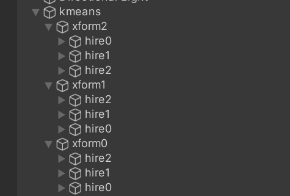
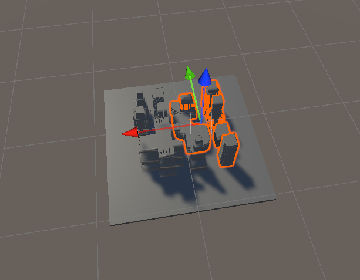
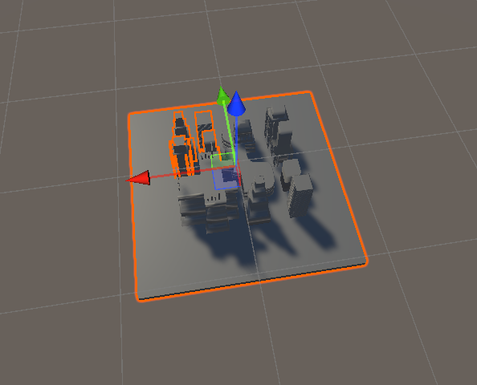
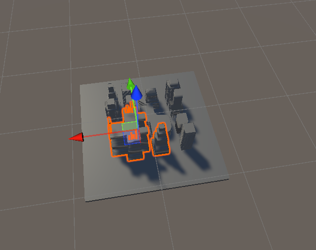

# usd-subdivide
a tool to divide the usd file gen from unity into several hierachy sub usd scenes
# results
after sub divide the usd stage turns into three sub usd stage ,and each stage can have hierachy based on the world position 

